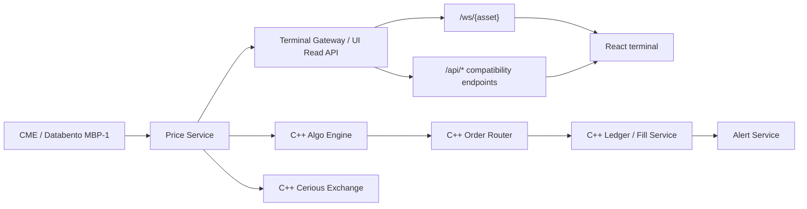

# Cerious Systems Architecture

## Direction

Cerious is a cloud-native browser terminal backed by modular native services.

## Current Local Mode

The trading critical path is native C++:

- price feed and normalized market state
- study snapshots used by charts and algos
- algo deployment state
- order routing
- Cerious local exchange matching
- live FIX routing
- fills, positions, and PnL ledger

The gateway and UI may expose read/control surfaces, but they must not own authoritative price, order, fill, position, PnL, or algo state.

## Constraint

CME is the only live ingress in this build. Legacy venue providers are copied only as preserved domain/reference material or removed from active service wiring.
